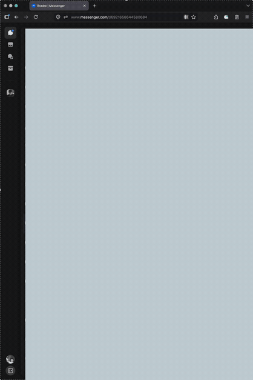
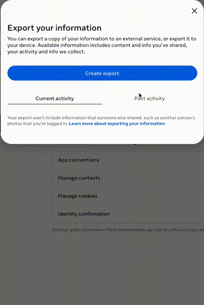
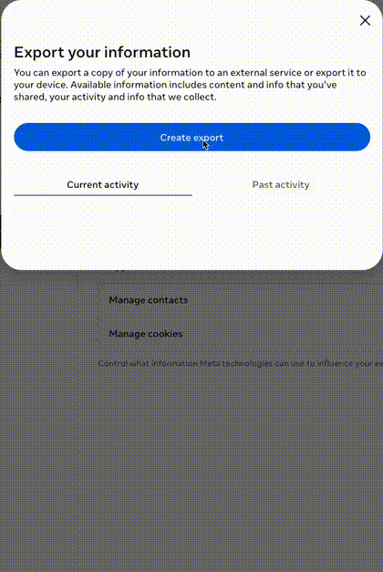
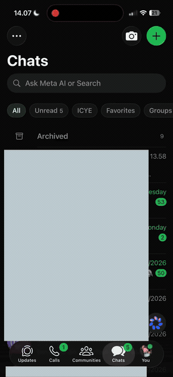

> Code for our MSc thesis, a continuation of our paper "LLMs as Proxy Survey Participants With RAG", by Elias Torjani, Airidas Brikas, and Daniel Hardt (our BSc thesis)

Check out our [abstract-length] paper on it: [Market research via persona-induced Large Language Models](https://sltc2024.github.io/abstracts/torjani.pdf), or see our poster below as a TL;DR

---
## How to reproduce our experiments with your own data
1. Export your chat messages from Facebook, Instagram, and/or WhatsApp (instructions below)
2. Take the surveys to constitute target responses, for the LLMs proxying you in the same surveys.
3. Clone this repository
4. Download ~~[Ollama](https://ollama.com/download/)~~, ~~llama.cpp+gguf-models~~ vLLM [WIP for HPC] to run inference locally.
   - *Any cloud provider is discouraged to mitigate leakage-risk of PII (sensive and private data).*
5. Run preprocessing script in folder w/ your exported data (zip/json). Standardized format, merge, dedup, chunk, and embed.
6. Run batch survey script w/ flags for your exported data, survey questions, and LLM model of choice.
7. Run analysis script to calculate fidelity and plot results.

---

If you are a donor here is the upload and survey [link](https://donate.torjani.app/). We'll give you a specific donor ID to add to your url, which only you should use.

<b>Export data from each platform</b>

*REQUIRED TO MESSENGER BEFORE FACEBOOK DUE TO ENCRYPTION-QUIRK!* 

1. [Messenger](https://www.messenger.com) --> click on your profile picture in bottom left corner --> `Privacy & safety` --> `End-to-end encrypted chats` --> `Message storage` (ensure Chat history Last backup is today's date) --> `Download message storage data` --> Select `All time` and `lower-quality media` --> `Download file`. \
2. [Facebook](https://accountscenter.facebook.com/info_and_permissions/dyi) (IG is also exported here in this url) --> `Create export` --> pick account[s] --> `export to device` --> `Customize information` --> Clear all other than `Messages` (Get `All time`, in `JSON` format, and pick `lower media quality`). Wait for email confirming the export is ready (~3 days for "all time") --> download zip file. \
3. [Instagram](https://accountscenter.facebook.com/info_and_permissions/dyi) Exact same process as Facebook, just pick your Instagram account instead. \
4. WhatsApp (via phone app) --> Settings --> `Chats` -->  `Export chat` --> pick your 1-on-1 chats to export (instant). \
5. Optional: Use Beeper's API to continuosly export new messages. But be aware of our experiment's scope being a snapshot in time. \

| 1. Messenger Demo | 2. FB Demo | 3. IG Demo | 4. WA Demo |
|---|---|---|---|
|  |  |  |  |

> [!NOTE]
> This fork is a refactored version of [this repository](https://github.com/Brikas/Thesis), where our original commit history is preserved. We refactored for speed, transparency, and reproducability.
